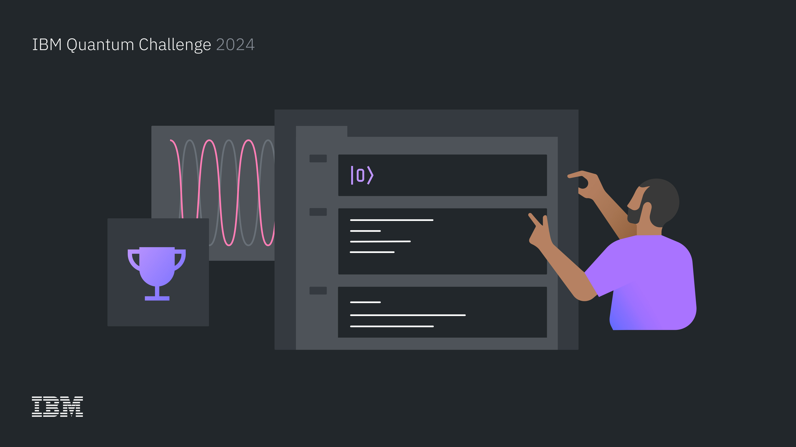
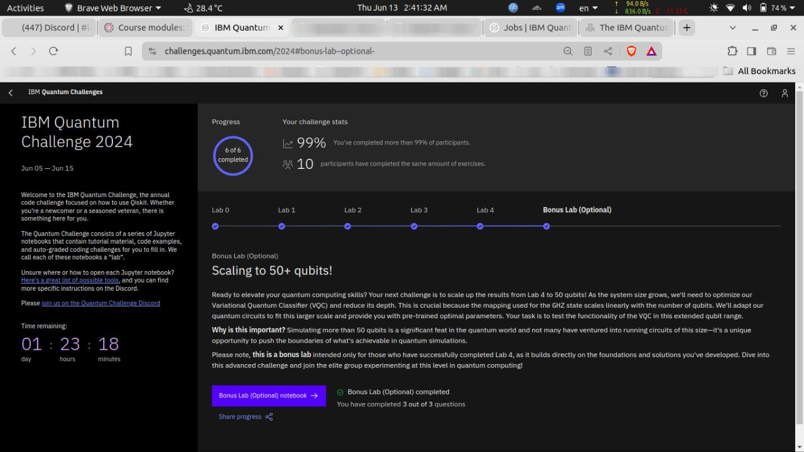
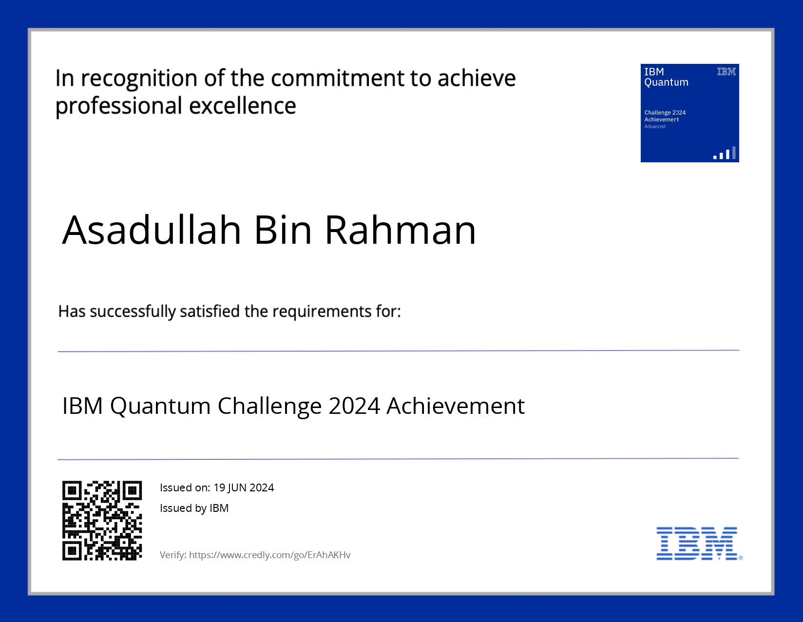

# IBM Quantum Challenge 2024 Solution


This repository includes my solution for the IBM Quantum Challenge 2024. Below is the list of tasks I completed. Each notebook is properly documented. To run, first install the required packages. Keep in mind that the graders won't work for you. And you will need an API token from IBM Quantum if you wish to run on real Quantum Hardware.

- Lab 0: Introductory challenges.
- Lab 1: Variational Quantum Eigensolver (VQE).
- Lab 2: Transpiler for circuit optimization.
- Lab 3: AI Transpiler, Circuit Knitting, Serverless Distributed Parallel Computing, and IBM's code assistant.
- Lab 4: Variational Quantum Classifier (VQC) on a real Quantum backend. Focus on reducing circuit depth, error suppression, and error mitigation to run on real Quantum hardware.
- Lab 5/Bonus Lab: Extension of lab 4, working on mapping 50 qubits on a 127-architecture system.

```bash
# Install Qiskit and relevant packages, if needed
pip install qiskit[visualization]==1.0.2
pip install qiskit-ibm-runtime
pip install qiskit-aer
pip install graphviz
pip install matplotlib
pip install pylatexenc
pip install circuit-knitting-toolbox
pip install qiskit-serverless
pip install qiskit-transpiler-service
```

|   :warning:   |              Graders won't work for you               |
|---------------|:------------------------------------------------------|


| :exclamation: | IMPORTANT: Make sure you are on 3.10 > python < 3.12  |
|---------------|:------------------------------------------------------|


|    :memo:     |   You will need an API token from IBM quantum to run on real Quantum Hardware    |
|---------------|:----------------------------------------------------------------------------------|





